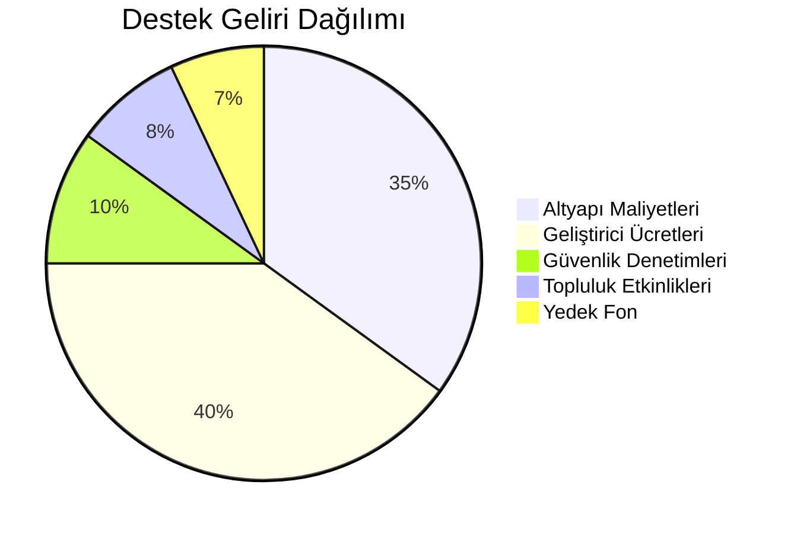

# 💝 Tayank'ı Destekleyin

Tayank, açık kaynak bir proje olarak topluluk desteğiyle gelişmeye devam ediyor. 
Projemizi desteklemek için çeşitli seçenekler bulunmaktadır.

## 🎯 Neden Destek Olmalısınız?

### 📈 Proje Gelişimi
- **Daha hızlı özellik geliştirme**
- **Güvenlik iyileştirmeleri**
- **Performans optimizasyonları**
- **Yeni platform desteği**

### 🌟 Topluluk Katkıları
- **Belgelendirme iyileştirmeleri**
- **Çeviriler ve yerelleştirme**
- **Eğitim içerikleri**
- **Topluluk etkinlikleri**

### 🔒 Kalite ve Güvenlik
- **Sürekli güvenlik denetimleri**
- **Kalite güvence testleri**
- **7/24 altyapı maliyetleri**
- **Yedekleme ve felaket kurtarma**

## 💳 Destek Seçenekleri

### 🤝 Bireysel Destek
| Platform | Açıklama | Avantajlar |
|----------|----------|------------|
| **GitHub Sponsors** | Doğrudan GitHub üzerinden | Özel badge, erken erişim |
| **Patreon** | Aylık destek | Özel içerik |
| **Ko-fi** | Tek seferlik bağış | Teşekkür mesajı, isim listesi |
| **Liberapay** | Özgür yazılım odaklı | Şeffaf, komisyonsuz |

### 🏢 Kurumsal Destek
| Seçenek | Açıklama | Faydalar |
|---------|----------|----------|
| **Open Collective** | Şeffaf kurumsal destek | Logo gösterimi, reklam |
| **Enterprise Sponsor** | Özel kurumsal paket | Öncelikli destek, özelleştirme |
| **Teknoloji Partneri** | Teknik işbirliği | Ortak pazarlama, referans |

### 🔧 Profesyonel Hizmetler
- **Özelleştirme ve entegrasyon**
- **Öncelikli teknik destek**
- **Eğitim ve danışmanlık**
- **Self-hosted çözümler**

## 🎁 Destekçi Avantajları

### 🥉 Bronz Destekçi (5-25$/ay)
- 📧 İsim listesinde yer alma
- 🎖️ Özel GitHub badge
- 📢 Duyurularda teşekkür

### 🥈 Gümüş Destekçi (25-100$/ay)
- 🚀 Beta özelliklere erişim
- 📝 Özellik önceliği

### 🥇 Altın Destekçi (100-500$/ay)
- 🔧 Doğrudan geliştirici erişimi
- 🎯 Roadmap etkisi
- 📊 Özel istatistikler

### 💎 Elmas Destekçi (500$+/ay)
- 🤝 Ortaklık görüşmeleri
- 🏢 Kurumsal tanıtım
- 🔒 Özel güvenlik brifingleri

## 🔄 Kaynak Dağılımı

## 🌍 Topluluk Katkıları

### Kod Katkısı
- 🐛 Hata düzeltmeleri
- 🚀 Yeni özellikler
- 📚 Dokümantasyon
- 🧪 Test yazımı

### Diğer Katkılar
- 🌐 Çeviriler
- 🎨 Tasarım
- 📢 Pazarlama
- 👥 Topluluk yönetimi

## 📊 Şeffaflık

Tüm finansal kayıtlar şurada açıktır:
- **Open Collective**: https://opencollective.com/tayank
- **GitHub Sponsors**: https://github.com/sponsors/Tayank-LTD

## 📞 İletişim

**Sponsorluk İşbirliği:**
- 📧 E-posta: [sponsor@tayank.com](mailto:sponsor@tayank.com)

**Kurumsal Destek:**
- 📧 E-posta: [enterprise@tayank.com](mailto:enterprise@tayank.com)
- 🌐 Website: [tayank.com/enterprise](https://tayank.com/enterprise)

---

## 🙏 Teşekkürler!

Desteğiniz sayesinde Tayank'ı daha da geliştirebiliyor ve 
açık kaynak topluluğuna katkıda bulunmaya devam ediyoruz.

**Birlikte daha iyisini inşa edelim! 🚀**